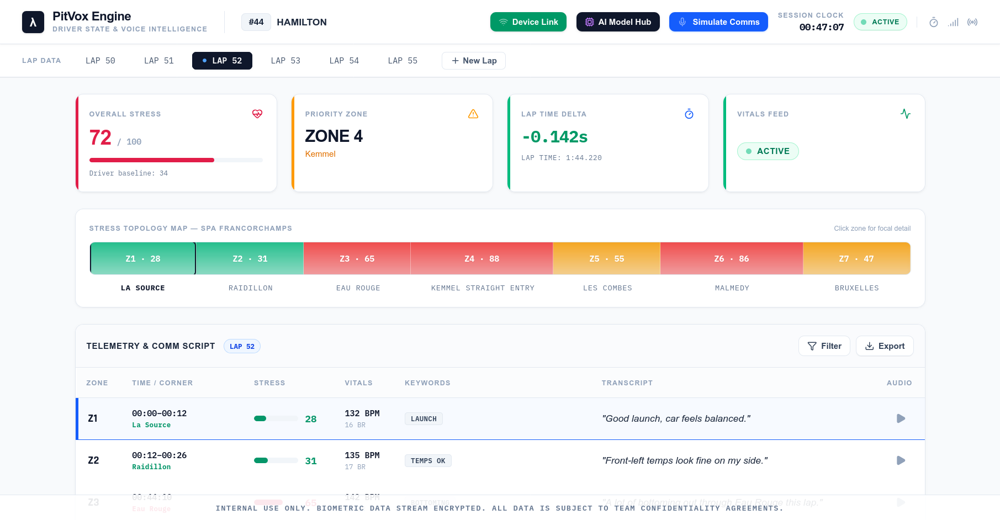

# PitVox


**PitVox** is a high-precision real-time motorsport telemetry and driver biometric voice intelligence dashboard built for Formula 1 and GT endurance race control pit walls.

## Key Features



- **Top Navigation Bar**: Live session clock timer, active status indicator, car `#44 HAMILTON` / `M. OKAFOR` driver profile, telemetry uplink status, and comms controls.
- **Lap Telemetry Selector**: Interactive lap switcher (`LAP 50` through `LAP 55`) with instant dataset loading and dynamic new lap simulator.
- **KPI Summary Row**: Real-time display of Overall Stress Index (with driver baseline target), Priority Zone tracking, Lap Time Delta (-0.142s / +0.9s), and Biometric Vitals feed uplink.
- **Stress Topology Map (Zone Ribbon)**: Interactive track topology ribbon (Spa Francorchamps circuit: La Source, Raidillon, Eau Rouge, Kemmel, Les Combes, Malmedy, Bruxelles) with color-coded stress gradients and active zone highlight frame.
- **Telemetry & Comm Script Table**: Complete zone-by-zone breakdown with filter modal/search, CSV telemetry export download, heart rate / breathing vitals, extracted keyword tags, driver transcripts, and audio playback buttons.
- **Focal Analysis Card**: Deep-dive zone telemetry with critical/high stress status badges, timestamp, stress index value, biometric load metrics (Heart Rate BPM, Breathing Rate BR, G-Force G), identified entity tags, extracted actionable team requirements, blockquote quote, and animated waveform audio player.
- **Biometric Load Gauge**: Analog semicircular gauge with smooth arc, rotating needle indicator, center hub, score, and state readout.
- **Stress vs. Lap Time Trend Chart**: SVG graph showing Delta Time curve vs Stress Index dashed curve across race laps.
- **System Notices ("Where To Focus")**: Live-computed priority recommendations, watch alerts, and stable status confirmations.
- **Pit Vox Radio Comms & Voice Simulator**: Interactive drawer allowing pit engineers to dictate or enter custom driver radio messages, run voice sentiment extraction, auto-update stress scores, and trigger authentic radio chirp audio playback.

## Building This Project

### Prerequisites
- Node.js 18+
- npm or yarn

### Installation
```bash
npm install
```

### Development Server
```bash
npm run dev
```

### Production Build
```bash
npm run build
```

**NOTE:** This project is in its building stage and is only meant for testing only and not for live application. Many bugs & UI related issues are need to be fixed. The project will be in production soon.
